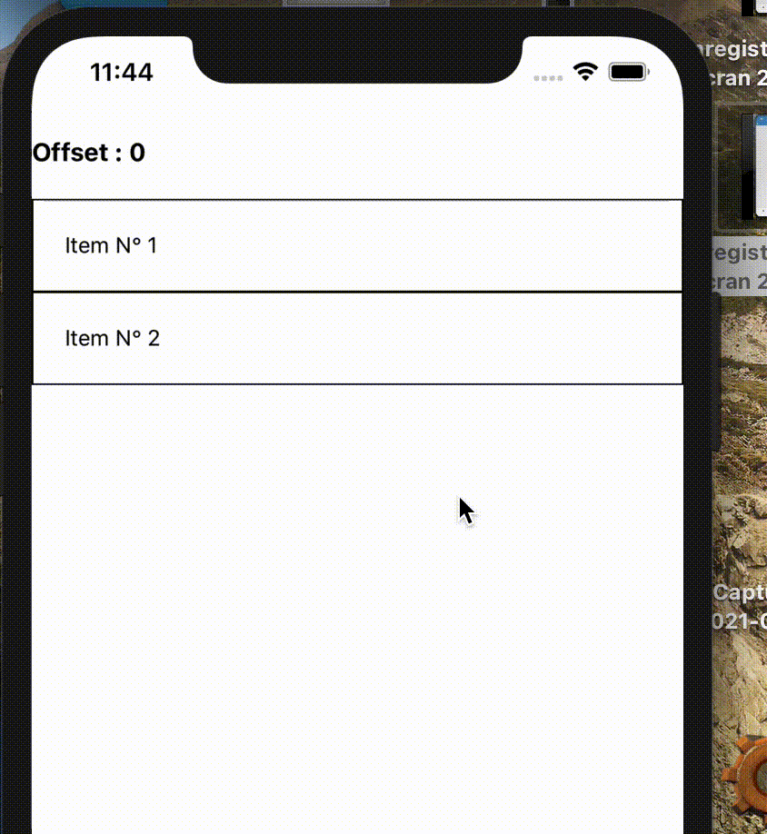
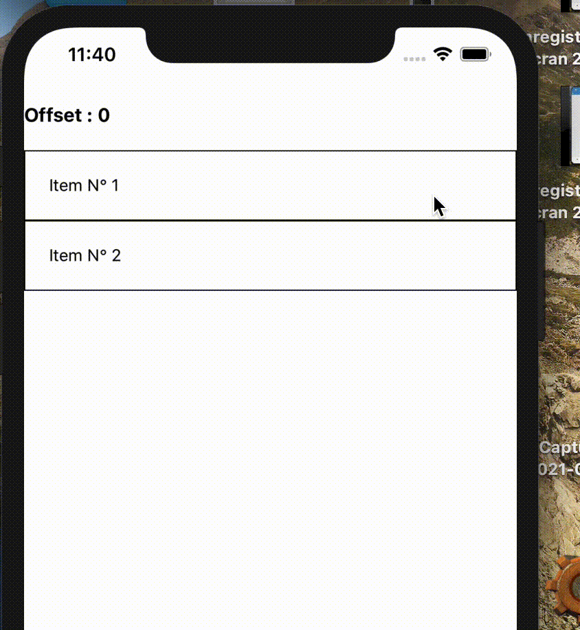

# This is a bug reproduction repository for [jemise111/react-native-swipe-list-view](https://github.com/jemise111/react-native-swipe-list-view)

#### Link to the issue : TODO

#### Steps to use this repo (as the bug is iOS related, you need a MacOS based computer and all the standard tool-suit) :

- clone the repo
- `yarn` to install dependencies
- `cd ios` + `pod install` to install pods
- `yarn start` (in a separated terminal tab)
- `yarn ios`
- The iOS simulator should start

#### Description :

This a basic use of react-native-swipe-list with two actions on the right only (left swipe is disabled). It is the most simple reproducible example I managed to make based on my actual code.

Here is a the standard way the vertical scrollable element works with this library when the content is smaller than the screen. You can see that after the scoll, the element will "go back" to it's initial position (offset is the SwipeList offset). In the end, we always end-up with an offset of 0. This is the expected behaviour.

Now, if you quickly swipe horizontaly an item inside the list, just on the screen edge, you can sometime end-up with a slight vertical scroll also. But, in this case after releasing the click (or your finger on a physical device) the scroll will not reset to 0. You can end-up with vertical positive or negative scroll without touching the screen. Event after locking the phone and unlocking the offset is still wrong.

It is slightly noticeable for a user, but in my case I have some logic based on the offset that is broken because of this.
